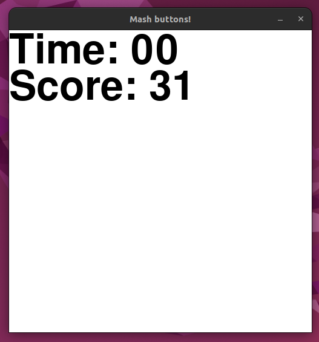
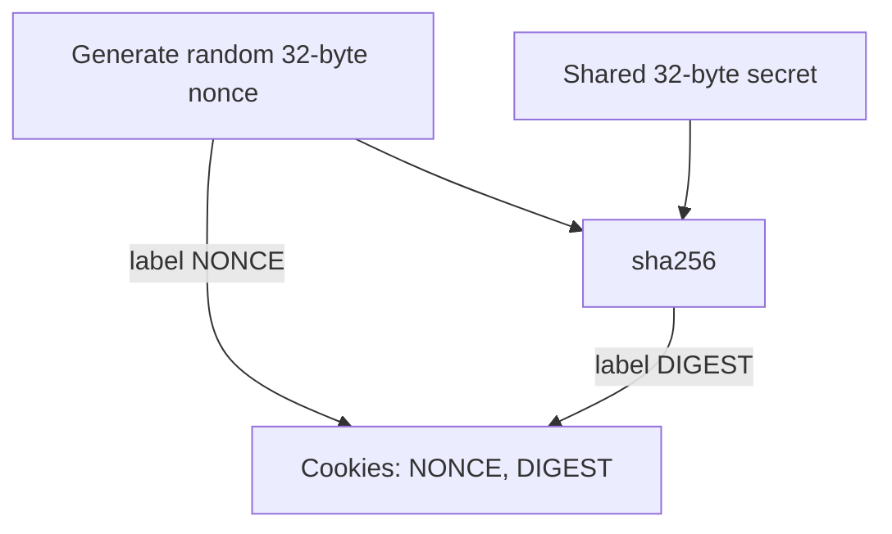
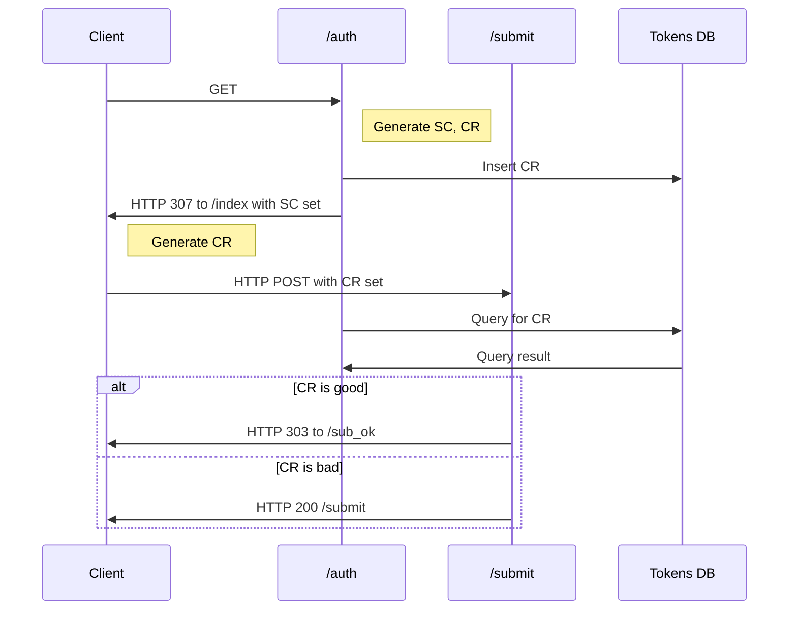

# practice-games-and-score-server

Simple games that report scores to a score server with various security
problems. For web app security practice and training.

## Games

There are two games available in `basic-games-client`:
- `clicker` - click on the object that randomly moves about the screen,
- `masher` - log as many keyboard presses as possible in a fixed amount of time.

To start a game, select the game and indicate a username with the
`basic-games-client` entrypoint. 

After every game, the `basic-games-client` submits the score and time-played
for the given username to the `basic-games-server`. The goal of the exercise is
to get impossibly good scores on the score server by replaying or
manipulating (with e.g. Burp Suite) network traffic between the two
applications. 

### Clicker Game

Use the mouse to click on the moving object as quickly as possible. The lower
the score, the better!

### Masher Game

Press keyboard buttons to accumulate as many keyboard presses as possible!

## Server

`basic-games-server` accepts high score submissions from authorized game
clients and records the best score for a given username and the last time that
user played.  In the masher game, a higher count is better. In the clicker
game, a lower time is better. The score server also hosts a scoreboard webpage
showing the scores in its local database. 

## Authentication

`basic-games-server` uses various mechanisms to only accept score submission
from `basic-games-client`. The client authenticates to the server in different
ways depending on for which game it is submitting a score. The clicker game
uses a weaker authentication method that is vulnerable to replay attacks. The
masher authentication method is intended to be harder to replay. Both
authentication methods make use of a shared secret between the client and the
server. The secret key is hard-coded into the code for convenience - this
should obviously not be done in production. Lastly, the `basic-games-client`
uses a specific user agent which the server checks for. 

### Clicker Game Authentication

When submitting scores to the server for the clicker game, the client generates
random bytes for a 'nonce', combines those bytes with the shared secret, and
hashes the result. When submitting a score as a POST form, the client sets a
`NONCE` cookie to the nonce value and a `DIGEST` cookie to the hash value. 

### Masher Game Authentication

When submitting scores to the server for the masher game, the client uses the
server's `/auth` endpoint to obtain a server-generated challenge value from the
`_SC` cookie. Both the server and client independently generate the
corresponding client response, the SHA-256 hash of the concatenated shared
secret and server challenge. The server stores the expected client response in
a tokens table for a limited amount of time. When the client submits scores
with a POST form to the `/submit` endpoint, it sets a `_CR` cookie to the client
response value. If the server finds the client response value in its table, the
score submission is accepted. A replay of a client request with a modified high
score is now difficult because the entries in the server's database of client response
tokens are removed after a single use and expire if not used quickly enough.

